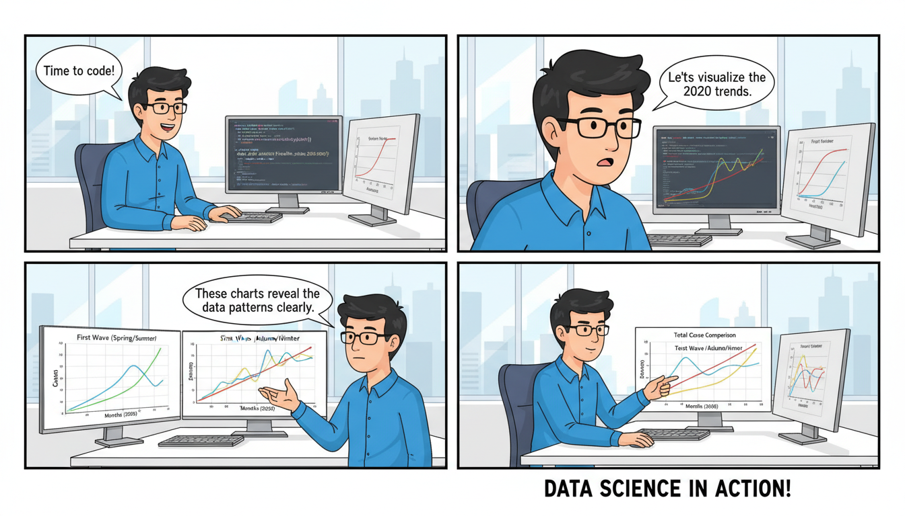

This is a professional and comprehensive `README.md` tailored for your repository. It highlights the technical aspects of the project while making it accessible to both developers and data analysts.

---

# COVID-19 Waves Analysis (2020)

[](https://www.python.org/)
[](https://jupyter.org/)
[](https://opensource.org/licenses/MIT)

## 📌 Project Overview
`data_analysis-covid_charts` is a focused data science project that explores the impact and progression of the COVID-19 pandemic during its critical early phases. The analysis specifically targets the **First and Second Waves** of the virus in 2020, providing visual insights into infection rates, mortality trends, and recovery patterns.

The core of the analysis is contained within `covid_ensayo.ipynb`, a comprehensive Jupyter Notebook that documents the data cleaning, processing, and visualization pipeline.

## 🚀 Key Features
- **Data Preprocessing:** Cleaning and structuring raw global health data for time-series analysis.
- **Wave Comparison:** Comparative visualization between the initial outbreak (Q1/Q2 2020) and the subsequent resurgence (Q3/Q4 2020).
- **Growth Modeling:** Calculation of daily growth rates and rolling averages to smooth out reporting fluctuations.
- **Statistical Visualization:** Interactive and static charts showing the correlation between lockdown measures and infection curves.

## 🛠️ Technical Stack
- **Language:** Python
- **Libraries:**
  - `Pandas`: For data manipulation and frame analysis.
  - `NumPy`: For numerical computations.
  - `Matplotlib` & `Seaborn`: For generating high-quality statistical graphics.
  - `Plotly` (Optional): For interactive time-series exploration.

## 📂 Repository Structure
```bash
.
├── covid_ensayo.ipynb   # Main analysis notebook containing code and findings
└── README.md            # Project documentation (this file)
```

## 💻 Getting Started

### Prerequisites
Ensure you have Python 3.8+ installed. It is recommended to use a virtual environment.

### Installation
1. **Clone the repository:**
   ```bash
   git clone https://github.com/your-username/data_analysis-covid_charts.git
   cd data_analysis-covid_charts
   ```

2. **Install dependencies:**
   ```bash
   pip install pandas numpy matplotlib seaborn jupyter
   ```

3. **Launch the analysis:**
   ```bash
   jupyter notebook covid_ensayo.ipynb
   ```

## 📊 Sample Code Snippet
The following logic is representative of the analysis performed in the notebook to calculate the 7-day moving average:

```python
import pandas as pd
import matplotlib.pyplot as plt

# Load dataset
df = pd.read_csv('covid_data.csv')
df['date'] = pd.to_datetime(df['date'])

# Filtering the first two waves of 2020
df_2020 = df[df['date'].dt.year == 2020]

# Calculating 7-day rolling average for new cases
df_2020['rolling_avg'] = df_2020['new_cases'].rolling(window=7).mean()

# Visualization
plt.figure(figsize=(12, 6))
plt.plot(df_2020['date'], df_2020['new_cases'], alpha=0.3, label='Daily Cases')
plt.plot(df_2020['date'], df_2020['rolling_avg'], color='red', label='7-Day Moving Avg')
plt.title('COVID-19 Waves Trend Analysis')
plt.legend()
plt.show()
```

## 📈 Analysis Insights
*Expected findings documented in the notebook include:*
- Identification of the "Peak" dates for various regions during the first wave.
- Observation of decreased mortality rates in the second wave despite higher infection numbers (potentially due to better hospital protocols).
- Visual evidence of the "flattening the curve" phenomenon following major lockdown periods.

## 📝 License
This project is licensed under the MIT License - see the [LICENSE](LICENSE) file for details.

## 🤝 Contributing
Contributions are welcome! If you have suggestions for new visualizations or data sources (e.g., vaccine rollout data), please open an issue or submit a pull request.

---
**Disclaimer:** *This analysis is for educational purposes and reflects data reported during the 2020 period. Always refer to the WHO or CDC for official medical statistics.*